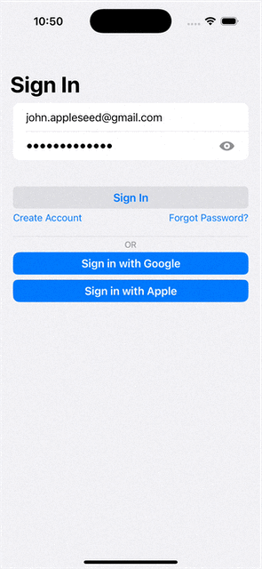

# Swift Authentication Reference Implementation

> A comprehensive, production-ready authentication system showcasing modern Swift development practices across backend and iOS platforms.

<<<<<<< HEAD
<!-- BODY -->

## Preview

### Auth Flow

<p align="left">
	
	
	
	
</p>

## Components
=======
## 🎯 **Project Vision**
>>>>>>> develop

This project demonstrates **best-in-class authentication architecture** using the latest Swift technologies and industry security standards. While themed as an ecommerce application for context, the core focus for now is building the most robust, secure, and modern authentication system possible with Swift.

## 🏗️ **Technical Architecture**

### **🏗️ Modern Swift Architecture**
- **Backend**: Built with [Hummingbird 2.0](https://github.com/hummingbird-project/hummingbird) - the next-generation Swift server framework
- **iOS Client**: SwiftUI with modern `@Observable` macro and `@MainActor` isolation
- **Networking**: Actor-based concurrency with automatic token refresh and race condition prevention
- **Security**: Keychain storage and JWT token management patterns

### **🔒 Security Features**
- **Multi-Factor Authentication (MFA)**:
  - TOTP (Time-based One-Time Passwords) with QR code generation
  - Email-based MFA with resend capabilities  
  - Recovery codes system with secure backup
  - Granular MFA method selection and management
- **Advanced Session Management**:
  - JWT tokens with automatic refresh
  - Actor-isolated token storage preventing race conditions
  - Account lockout with configurable retry policies
  - Rate limiting with permit-based system
- **Social Authentication**:
  - Google Sign-In integration
  - Apple Sign In support
  - Unified response handling across all auth methods

#### 🔐 **Authentication & Authorization**
- **Core Authentication**:
  - Email/Username + Password sign-in
  - Social authentication (Google, Apple)
  - Multi-factor authentication (TOTP, Email)
  - Password reset with email verification
  - Account recovery with backup codes
  - Role-based access control (planned)

#### 🛡️ **Security Implementation**
- **Password Security**:
  - Secure password validation and hashing (bcrypt)
  - Password history tracking
  - Account lockout protection
- **Token Management**:
  - JWT-based authentication with refresh tokens
  - Token blacklisting and invalidation
  - Secure token rotation
  - Concurrent session management
- **Protection Mechanisms**:
  - Rate limiting with exponential backoff
  - Brute force protection
  - Account lockout with retry policies
  - Certificate pinning (planned)

#### 📧 **Email Communications**
- **Verification Flows**:
  - Email verification during registration
  - MFA setup notifications
  - Password reset emails
  - Security notifications
- **Integration**:
  - SendGrid email service integration
  - Configurable email templates

#### 📱 **iOS Client Features**
- **Authentication Flow**:
  - SwiftUI-based sign up/sign in screens
  - Social authentication integration
  - MFA support with QR code scanning
  - Password recovery flow
  - Secure token storage using Keychain
  - Biometric authentication (planned)
- **User Experience**:
  - Real-time form validation
  - Intelligent error handling and recovery
  - Seamless MFA setup with QR codes
  - Progressive authentication flows
  - Localization support (planned)
  - Push notifications (planned)
  - Offline support (planned)

### **⚡ Technical Features**
- **Sophisticated Error Handling**: Typed errors with comprehensive HTTP status mapping
- **Network Resilience**: Exponential backoff, retry logic, and response caching
- **Security Best Practices**: Keychain storage, bearer token injection, secure password reset flows
- **Comprehensive Testing**: Full test suite covering auth flows and edge cases

## 🏛️ **Architecture Overview**

### **Backend (Swift Server)**
```
├── Controllers/
│   ├── AuthController.swift         # Core authentication
│   ├── EmailMFAController.swift     # Email-based MFA
│   ├── TOTPController.swift         # TOTP management
│   ├── MFARecoveryController.swift  # Recovery codes
│   ├── OAuthController.swift        # OAuth flows
│   ├── SocialAuthController.swift   # Social login
│   └── UserController.swift         # User management
├── Models/
│   ├── User/                        # User entities and DTOs
│   └── Auth/                        # Authentication models
├── Services/                        # Business logic layer
├── Middleware/                      # Request/response middleware
└── Migrations/                      # Database schema
```

### **iOS Client (SwiftUI)**
```
├── Authentication/
│   ├── AuthManager.swift            # Central auth orchestration
│   ├── TOTPManager.swift            # TOTP MFA management
│   ├── EmailVerificationManager.swift # Email verification flows
│   ├── SocialAuthManager.swift      # Social login coordination
│   └── Views/                       # SwiftUI authentication views
├── Networking/
│   ├── NetworkManager.swift         # Actor-based HTTP client
│   ├── AuthorizationManager.swift   # Token lifecycle management
│   ├── TokenStore.swift             # Keychain-backed storage
│   └── RetryHandler.swift           # Network resilience
└── Models/                          # Shared data models
```

## 🛠️ **Key Technologies**

### **Backend Stack**
- [Hummingbird 2.0](https://github.com/hummingbird-project/hummingbird) - Modern async server framework
- [Hummingbird Auth 2.0](https://github.com/hummingbird-project/hummingbird-auth) - Advanced authentication
- [JWT Kit 5.0-beta](https://github.com/vapor/jwt-kit) - JSON Web Token implementation
- [AsyncHTTPClient 1.19](https://github.com/swift-server/async-http-client) - High-performance HTTP
- [PostgreSQL](https://github.com/vapor/postgres-kit) - Production database with migrations

### **iOS Stack**
- **SwiftUI** with `@Observable` and `@MainActor` patterns
- **Swift Concurrency** - Full async/await with actor isolation
- **Keychain Services** - Secure credential storage
- **Network Framework** - Modern HTTP client with caching

### **Security & Infrastructure**
- [Swift Crypto](https://github.com/apple/swift-crypto) - Apple's cryptographic library
- [TOTP RFC 6238](https://tools.ietf.org/html/rfc6238) - Time-based one-time passwords
- [OAuth 2.0](https://oauth.net/2/) - Industry standard authorization
- [JWT RFC 7519](https://tools.ietf.org/html/rfc7519) - Secure token format

## 🚀 **Getting Started**

### **Prerequisites**
- **Xcode 15.0+** with Swift 5.9+
- **macOS 14.0+** for development
- **PostgreSQL 14+** for backend database
- **Docker** (optional) for containerized development

### **Backend Setup**
```bash
cd EcommerceServer
swift package resolve
swift run App serve --port 8080
```

### **iOS Setup**
```bash
cd Ecommerce
open Ecommerce.xcodeproj
# Configure your development team and run
```

### **Environment Configuration**
Copy `.env.example` to `.env` and configure:
```bash
DATABASE_URL=postgresql://localhost:5432/ecommerce
JWT_SECRET=your-secret-key
SENDGRID_API_KEY=your-sendgrid-key
GOOGLE_CLIENT_ID=your-google-client-id
```

## 📱 **Features Showcase**

### **Authentication Flows**
- ✅ Email/Username + Password sign-in
- ✅ Social authentication (Google, Apple)
- ✅ Multi-factor authentication (TOTP, Email)
- ✅ Password reset with email verification
- ✅ Account recovery with backup codes

### **Security Features**
- ✅ JWT token-based authentication
- ✅ Automatic token refresh with race condition prevention
- ✅ Account lockout after failed attempts
- ✅ Rate limiting and DDoS protection
- ✅ Secure password hashing (bcrypt)
- ✅ CSRF protection and secure headers

### **User Experience**
- ✅ Seamless MFA setup with QR codes
- ✅ Progressive authentication flows
- ✅ Intelligent error handling and recovery
- ✅ Offline-capable with local caching
- ✅ Accessibility support (VoiceOver, Dynamic Type)

## 🧪 **Testing**

### **Backend Tests**
```bash
swift test --parallel
```

### **iOS Tests**
```bash
xcodebuild test -project Ecommerce.xcodeproj -scheme Ecommerce -destination 'platform=iOS Simulator,name=iPhone 15'
```

## 📚 **Documentation**

- [**Setup Guide**](Documentation/SETUP.md) - Detailed installation instructions
- [**API Reference**](Documentation/API.md) - Complete backend API documentation
- [**Security Model**](Documentation/SECURITY.md) - Security implementation details
- [**Architecture Guide**](Documentation/ARCHITECTURE.md) - System design and patterns

## 🙏 **Acknowledgments**

Built with cutting-edge Swift technologies:
- [Hummingbird 2.0](https://github.com/hummingbird-project/hummingbird) - Next-generation Swift server framework
- [Hummingbird Auth 2.0](https://github.com/hummingbird-project/hummingbird-auth) - Advanced authentication framework
- [Hummingbird Fluent 2.0-beta](https://github.com/hummingbird-project/hummingbird-fluent) - Modern ORM integration
- [JWT Kit 5.0-beta](https://github.com/vapor/jwt-kit) - Latest JSON Web Token implementation
- [AsyncHTTPClient 1.19](https://github.com/swift-server/async-http-client) - High-performance HTTP client
- [SendGrid Kit 3.0](https://github.com/vapor-community/sendgrid-kit) - Email service integration
- [Swift Crypto](https://github.com/apple/swift-crypto) - Apple's cryptographic library
- [GoogleSignIn](https://github.com/google/GoogleSignIn-iOS) - Google authentication SDK
- [KeychainSwift](https://github.com/evgenyneu/keychain-swift) - Keychain wrapper library

## 📄 **License**

This project is open source and available under the [MIT License](LICENSE).

---
